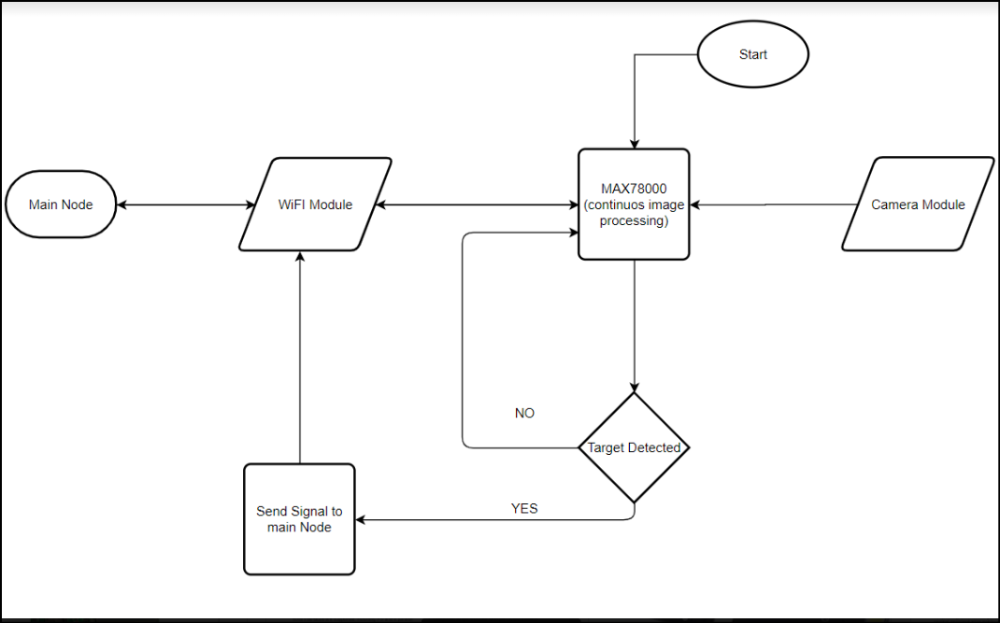
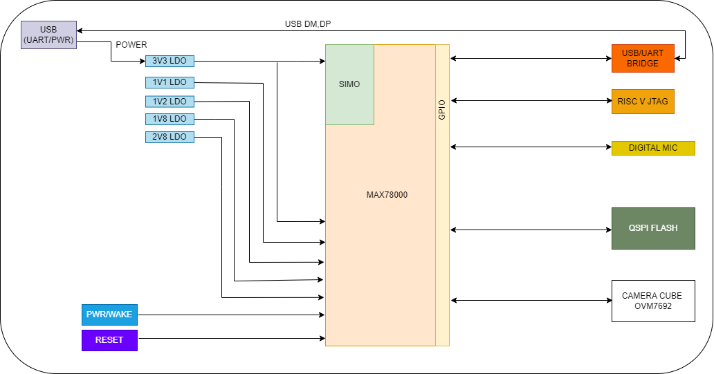

# Architecture Development
As a systems engineer I wish to look at things from the bigger perspective and derive certain road maps for the design creation. 

Think of it like developing an Algorithm, an overview of things with a fundamental mathematics is needed.
Here the fundamental knowledge needed is generally about the RF and Electromagnetic Theories.

## Specifications
These arrive generally as a strong foothold for the design development, before the architecture or the specs, there exists an Idea.

First and foremost, put it on Pen and Paper, and define what part of the Idea needs this development of hardware and how are you coping up with the software development.

Once you know what is on the line for the development process, you need to push the idea to a stage of rough specifications. What all should they include?

An example is of the below pen paper design converted to a visual one using [draw.io](draw.io)

1. **Don’t** go deep in the specifications, keep it superficial and integrated. Make sure various systems correlate with each other that is the only thing to do, all of this without diving too deep into the specs.
2. **Don’t** try to be rigid with the interfaces, always a good option to use generic and futuristic designs. You should never, in the future, feel some extra feature should have been added.

Choose the components wisely according to their availability, costing and lead times. Smaller Footprints, lesser extra components needed, low power consumption and regular packages such as QFN, DIP are suggested, take inputs of special requirements from their eval board. Much information will be available on the eval kits and they will serve as a potential mark on how the IC shall behave when operated.

1. Use Mouser for component search (Major IC order them fast, chip shortage is quite true!!)
2. Longer lead time is an indication to shift to a different major IC.
3. Try to order Eval Kits for all the major IC and check the functionlity if you have larger budget. Below is the image for the above given example.

